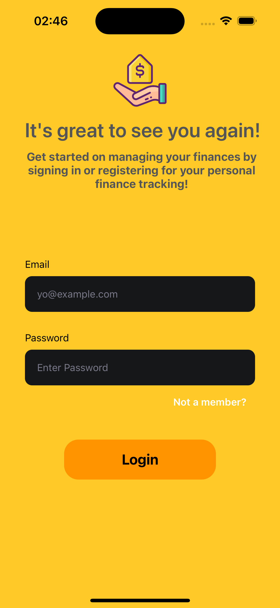
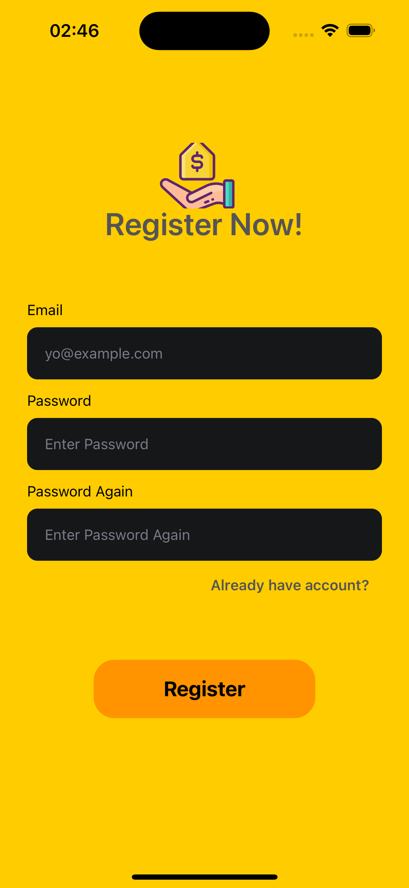
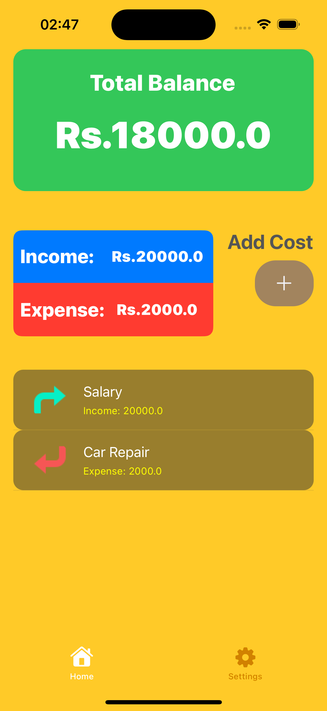
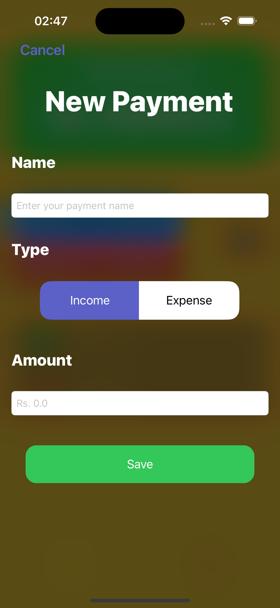
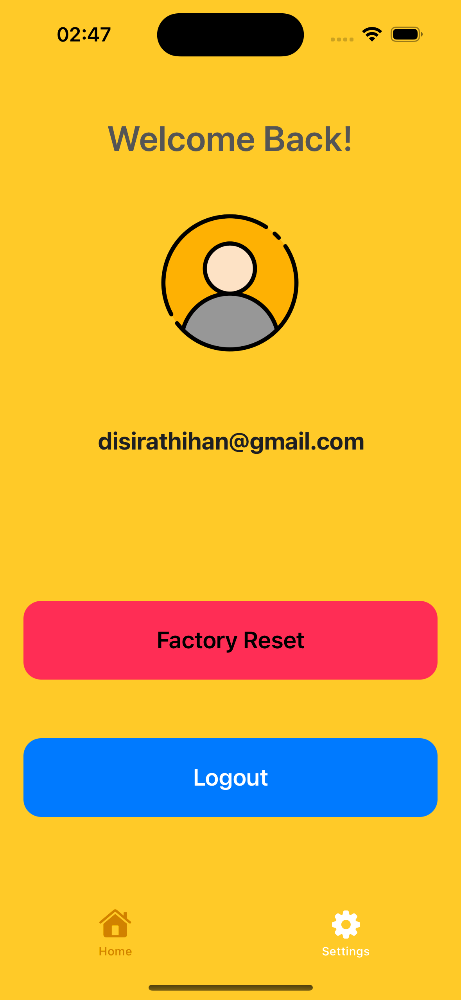
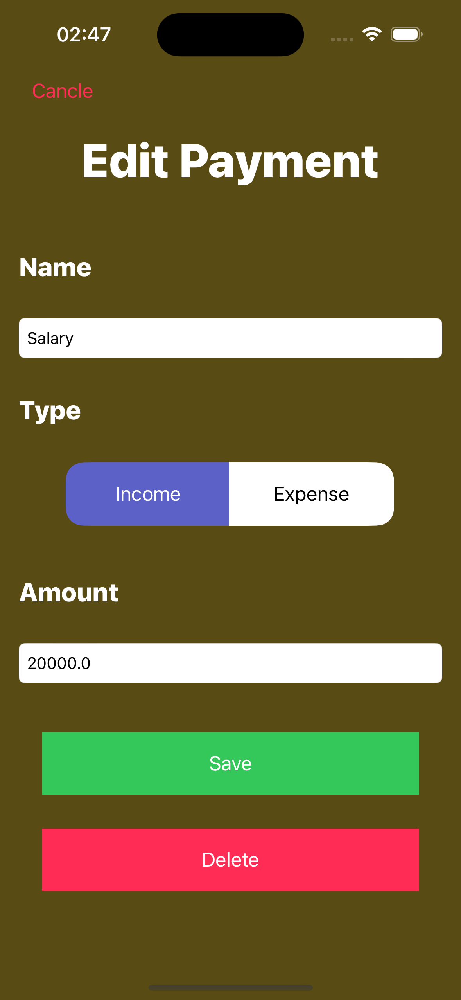

# Project Name - Expense Tracker
# Student Id - IT21070358
# Student Name - Thihan D.P.D

#### 01. Brief Description of Project - 
Expense Tracker is an application designed to help users manage their finances by tracking their incomes and expenses. Users can create a personal account, add, edit, and delete payments, and view their financial transactions within the app. The app calculates the balance based on the user's income and expenses, providing insights into their financial health.

#### 02. Users of the System - 
The primary users of the Expense Tracker system are individuals who want to monitor their financial activities and maintain a better understanding of their spending habits. It can be used by anyone who needs assistance in managing their finances effectively.

#### 03. What is unique about your solution -
Expense Tracker provides a user-friendly interface for managing financial transactions. It allows users to categorize their payments as income or expense, providing a clear overview of their financial activities. Additionally, the app calculates the balance in real-time, helping users track their financial status effortlessly.

#### 04. Briefly document the functionality of the screens you have (Include screen shots of images)
The app consists of several screens to facilitate various functionalities:

- **Login/Register Screen**: Users can create a new account or log in with existing credentials.
  
- **Dashboard Screen**: The dashboard provides an overview of the user's balance, total income, and total expenses.

- **Payments Screen**: Users can view a list of their payments, including details such as name, type (income/expense), and amount.

- **Add Payment Screen**: Allows users to add a new payment by providing details such as name, type, and amount.

- **Edit Payment Screen**: Enables users to edit existing payments, modifying details like name, type, and amount.

 | 
:------------------------------------------------------------------------------:|:----------------------------------------------------------------------------------:
Login Screen                                                                   | Register Screen

 | 
:--------------------------------------------------------------------------------:|:-----------------------------------------------------------------------------------:
Dashboard Screen                                                               | Payments Screen

 | 
:--------------------------------------------------------------------------------------------------:|:---------------------------------------------------------------------------------------:
Profile/Settings Payment Screen                                                                   | Edit Payment Screen


#### 05. Give examples of best practices used when writing code
The following best practices were employed while developing the Expense Tracker app:

- Consistent naming conventions for variables, functions, and classes.
  
- Usage of structures and constants to ensure data integrity and avoid mutable state where possible.
  
- Segregation of responsibilities using the Model-View-Controller (MVC) architectural pattern for maintainability and scalability.

```swift
struct Payment {
    let name: String
    let type: PaymentType
    let amount: Double
}

```

#### 06. UI Components used

The following UI components were utilized in the Expense Tracker app:

UILabel
UITextField
UITableView
UIButton
UITableViewController
UINavigationController
UIViewController

#### 07. Testing carried out

Unit testing was conducted for critical components of the app, such as payment calculations and data persistence. Additionally, manual testing was performed to ensure the app's usability and functionality across different devices and scenarios.

```swift
class MockPaymentViewModel: PaymentViewModel {
    var payments: [Payment]?
    var error: Error?
    override func fetchPayments(userId: String, completion: @escaping ([Payment]?, Error?) -> Void) {
        completion(payments, error)
    }
}
```

#### 08. Documentation 

(a) Design Choices:
- Utilized Firebase for user authentication and cloud Firestore for data storage.
- Implemented a clean and intuitive user interface for easy navigation and interaction.
- Employed Swift programming language and UIKit framework for iOS app development.

(b) Implementation Decisions:
- Used MVC architectural pattern to separate concerns and enhance code organization.
- Employed delegation and closures for communication between view controllers and data models.
- Implemented error handling to provide informative feedback to users and handle unexpected scenarios gracefully.

(c) Challenges:
- Implementing real-time balance calculation based on dynamic income and expense data.
- Ensuring data consistency and synchronization across multiple devices and user sessions.
- Handling edge cases and potential errors in user inputs and network operations.

#### 09. Reflection

Building the Expense Tracker app was an insightful learning experience, and it presented various challenges and opportunities for improvement. Some of the challenges faced included dealing with asynchronous data fetching and updating, ensuring data integrity and security, and optimizing app performance for a seamless user experience. In hindsight, I could have approached certain aspects of the assignment differently by conducting more thorough research and planning, collaborating with peers for feedback and insights, and leveraging additional resources and libraries to expedite development and enhance functionality.

Overall, the Expense Tracker app serves as a valuable tool for individuals seeking to gain better control over their finances and make informed decisions regarding their spending and saving habits. As technology continues to evolve, there is immense potential for further refinement and expansion of the app's features and capabilities to cater to the evolving needs and preferences of users in the realm of personal finance management.

  

# IOS-Expense-Tracker
